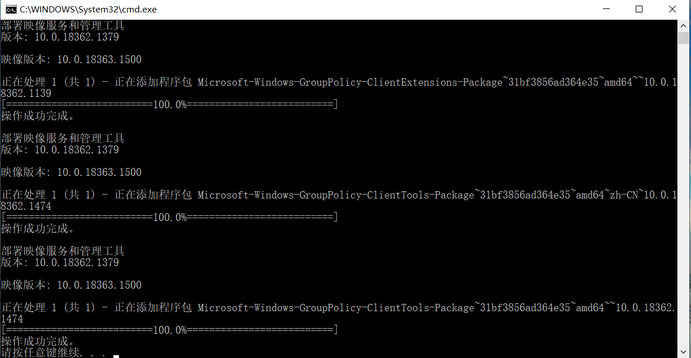
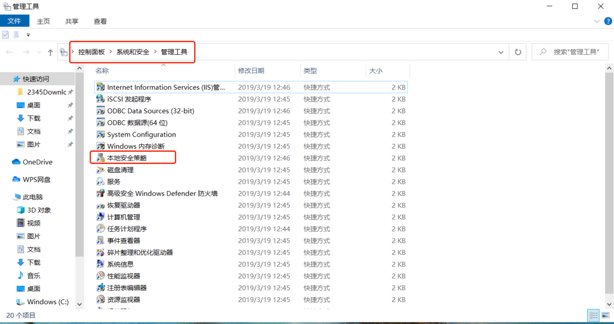
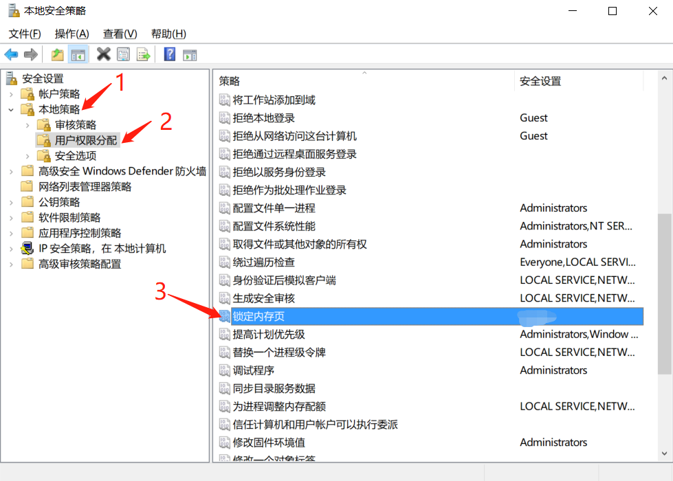
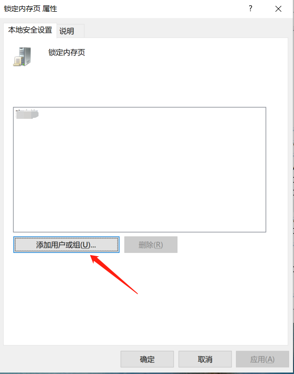

# Win10 Configuration RandomX Algorithm Environment

### Enable local security group policy

This step is only required for home version users, and the professional version opens the local security group policy by default, and users do not need to operate

- Create a new blank txt file, enter the following content and save

```shell
@echo off
 
pushd "%~dp0"
 
dir /b C:\Windows\servicing\Packages\Microsoft-Windows-GroupPolicy-ClientExtensions-Package~3*.mum >List.txt
 
dir /b C:\Windows\servicing\Packages\Microsoft-Windows-GroupPolicy-ClientTools-Package~3*.mum >>List.txt
 
for /f %%i in ('findstr /i . List.txt 2^>nul') do dism /online /norestart /add-package:"C:\Windows\servicing\Packages\%%i"
 
pause
```

- Modify the above file to xxx.bat file, then right-click to run as an administrator, and wait for the program to end



### Open hugeoage

- Right click on Win10 computer `Start`

- Find the `windows management tool`, and open it after going to the `local security policy`



- Click `Local Policies`->`User Rights Assignment`->`Lock Memory Pages`



- Add the computer user name for the locked memory page, restart the computer after confirmation


