# XDAG: A new DAG-based cryptocurrency
## 导读
XDAG是一个基于有向无环图（DAG）基础架构的新一代公链，是首个可挖矿、纯社区驱动的DAG+POW项目，主网在2018年1月上线。XDAG在保持了高并发性的特点同时解决了目前传统区块链技术无法解决的“不可能三角”（去中心化、安全、高并发）矛盾,总量14.46294144亿。XDAG没有项目方，没有ico、没有私募、没有预挖矿，全靠来自世界各地的极客爱好者共同组织开发维护，真正去中心化、高效、安全，公平公正。

XDAG虽然是一个DAG项目，但它的交易模型用的是和比特币类似的UTXO，而项目的发展也和比特币的发展有几分相似之处。

## XDAG的传奇故事 
XDAG是俄罗斯一个大学的数学教授在2017年9月开始实施的，他的网名叫Cheatoshi。因为觉得当前的加密货币项目自己不是非常满意，而且他自己在工程和数学方面也有一些积累，所以就想自己做一个加密货币的项目，他选择了DAG，用POW是因为它认为POW代表了区块链的精神，开放并且任何人都可以加入做贡献，Cheatoshi花了3个月的时间做完了这个项目，2017年12月份尝试上线，然后失败了，又花了几天时间，解决问题后在2018年1月再次上线了，这次使得XDAG成功上线。

2018年1月5日Cheatosin 在BitcoinTalk论坛发布了XDAG创始帖，宣称要创造一个基于DAG技术的公平的加密货币体系。当时大家都在Bitcointalk上交流，2018年2月，Cheatoshi把项目开源出来让社区参与贡献，之后大家把项目迁移到了github上，再之后Cheatoshi就完全消失了，完全把项目交给社区去管理，这个经历和当年的中本聪很像。向XDAG的原作者Cheatoshi致敬！

XDAG是第一个支持挖矿的DAG（IOTA不算真正的挖矿），同时没有预挖，没有ic0，并且完全是由社区驱动的，没有公司、项目方、资金方推动，开发者都是全球各地极客业余的时间无偿贡献，与bitcoin类似。

## 去中心化技术当前的问题和尝试
虽然行业经过多年发展，但是基于blockchain的区块链技术本身也面临诸多问题，并且随着普及范围扩大这些问题也越来越突出。

目前遇到的问题主要有以下两个方面：
1. blockchain本身的TPS瓶颈限制了区块链技术的性能
2. blockchain较长的确认时间也限制了区块链技术的广泛应用

尽管业内众多blockchain开发者，都在尝试寻找各种技术手段，来解决当前遇到的这些问题，但是从当前技术发展现状来看，各种尝试并没有取得突破性进展。
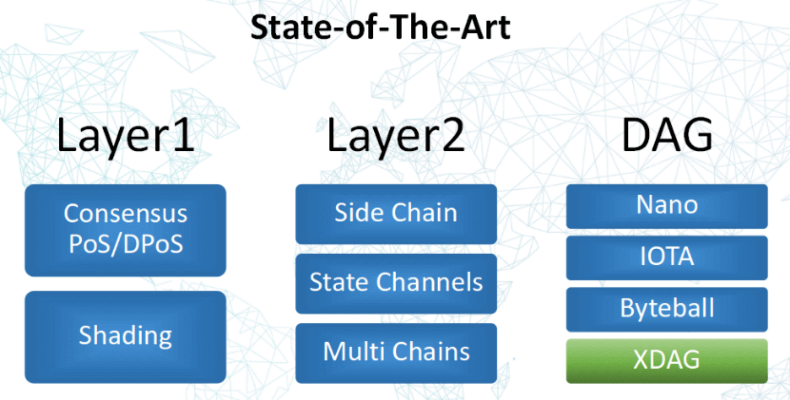
目前尝试的方式包括：
1. Layer 1（分片）

   PoS/DPoS等共识方面的探索•Sharding（分片计算）
2. Layer 2（侧链）

    Side Chain•State Channels•Multi Chains
   
针对BlockChain的缺陷，不管是EOS偏中心化的解决方案，还是目前如火如荼的分片技术、侧链技术都存在一些无法解决的问题，这一现状间接说明基于blockchain本身再去扩展将面临巨大困难和挑战，这就出现了第三种选择：DAG。

DAG相对比较特殊，数据结构与区块链不同，天生即拥有高可扩展性。采用DAG技术中最知名的项目是IOTA，但IOTA仍存在中心化的问题；XDAG在这基础上做了改变，将已被证明是最优共识方案的PoW加入，把验证交易的工作专门交由矿工来做，并保留了DAG原有的优点。

XDAG是纯粹的社区驱动项目，每位社区成员都在自发推动XDAG的进步，然而社区自治方式方式丝毫没有降低XDAG开发速度和质量，技术上首创DAG+POW方式，真正解决了传统区块链的问题。

## XDAG技术详解

DAG (Directed Acyclic Graph 有向无环图) 并不是一个刚出现的技术，而是在数学的一个分支——图论中的数学概念，早在1736年被提出，在计算机技术中，则是在计算机科学与技术初期就已经存在的一种数据存储结构。从理论上而言DAG结构比单链结构更复杂，但拥有更好的扩展性。

目前，业内已经有一些基于DAG数据结构的公链存在，但是每个公链都因为对于DAG技术的理解不同实现路线和适用场景不尽相同。
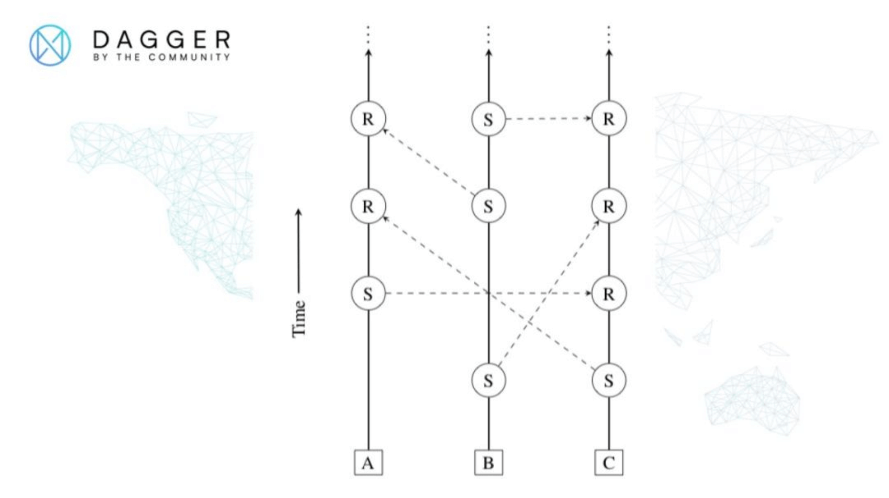
这是NANO的实现方式，主要思路是每个账户拥有自己的一条链，不同账户之间根据交易记录串联起来，从而形成DAG
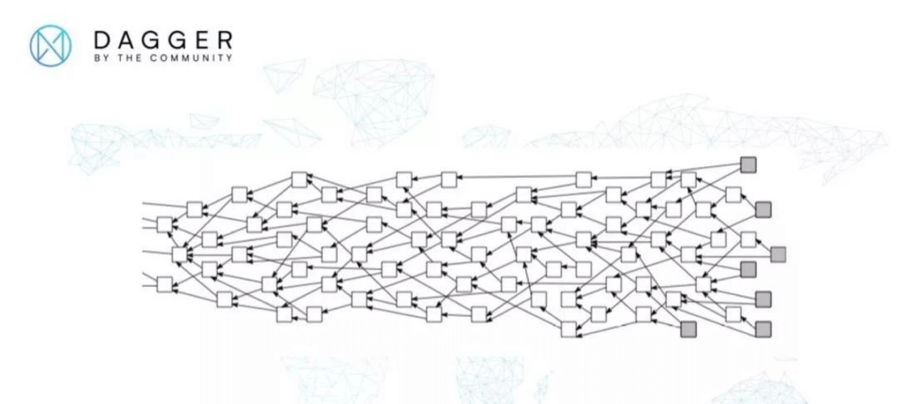
这是IOTA的DAG样子，主要思路是根据交易不同的高度和权重让使用者来确定交易有效性。
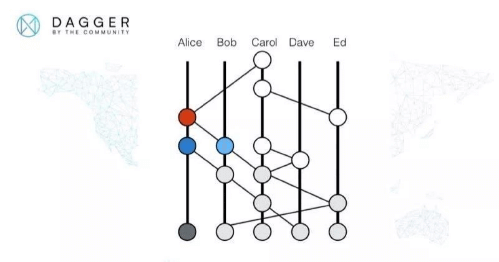
这是Hashgraph的DAG样子，主要思路在于利用节点间的修改过的gossip算法传播的交易信息构成时间上的序列，从而构成DAG。
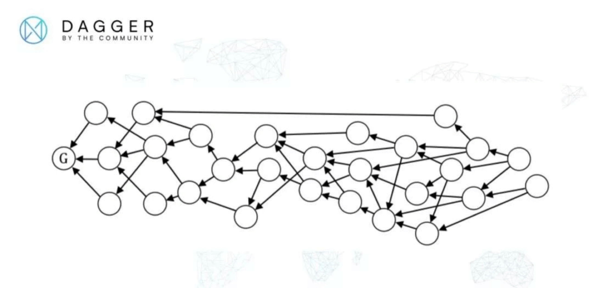
这是Byteball的DAG样子，它的思路在于：利用见证人节点向每一个交易后追加见证人单元来增加分支上的权重，从而确定当前DAG中的主链。

而以上的多种DAG实现并没有很好的解决去中心化、高TPS和低确认时间。 

与众不同的是XDAG尝试通过从区块链技术底层的数据结构开始重新设计，并采用另外一种DAG构成方式，巧妙的将PoW共识算法和DAG技术相结合，并同时提供了不同节点之间交易并发处理方式，在确保的网络安全性和公平性的前提下提高TPS降低确认时间。
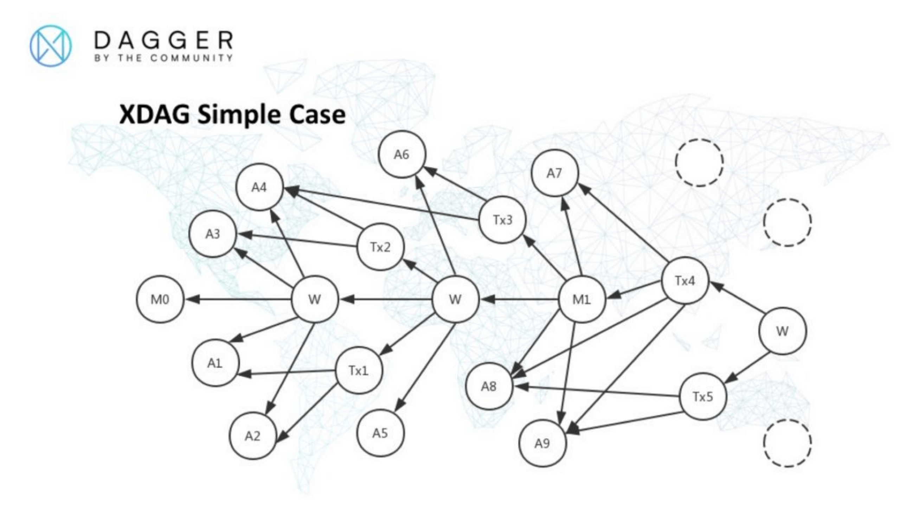
XDAG中一个局部的DAG组成。A 表示钱包地址块，Tx表示交易块，M表示PoW产生的主块，W我将其命名为见证块。
在XDAG中一直有个特点，就是区块 = 交易 = 地址
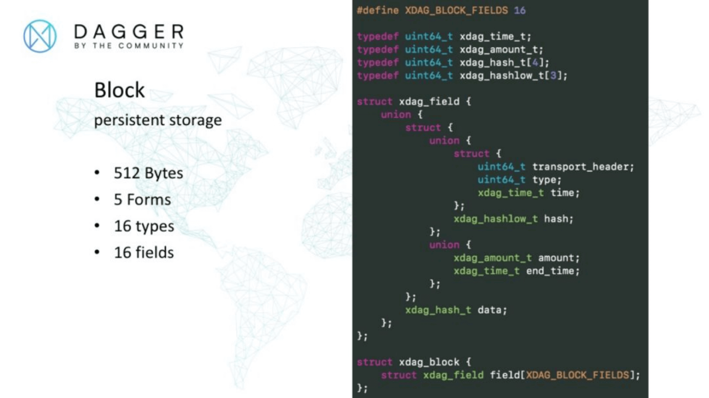
在XDAG中区块的数据 结构如上图中所示，这个数据结构是用来持久化存储数据使用。

块结构通过16个名为xdag_field的结构组成，每个xdag_field都是一个结构体，其中由结构体和联合体组成。

transport_header在传输时用来表示序列号，在接收后处理时用来保存下一个块的地址。 

type是一个64位的字段，用来表示一个块中16个field的类型，其中划分成16部分，每部分4bit，也就是半个字节，4位可以表示16种类型，因此type这个字段每4位表示一个field对应的类型。 

time是用来表示块产生的时间，采用的格式是1/1024秒，一秒钟在其中表示为2^10。 同时在节点间数据交换时作为请求时间范围的起始时间点。

hash是一个24字节的截断哈希值，通常是另一个区块的截断哈希值。amount是以cheato为单位的数量值，用来记录XDAG数量，cheato是XDAG中的基本单位，1个XDAG包含有2^32个cheato。

end_time 用来表示节点间数据交换时作为请求时间范围的终止时间点。data 是32字节的哈希值。

在XDAG中以上描述的块是完全由每个节点、每个钱包自己独立生成，不会受其他干扰，从而在基础设计上保证了区块处理的独立性，也为后续提到的高TPS打下基础。

XDAG的特点：

支持POW挖矿去中心化tps高。之前遇到交易风暴的时候，交易量可以达到几千Block = Transaction = Address。在XDAG中提到的块也是一笔交易，后面提到的块也可以作为交易来理解，钱包所生成的地址（Address）也会在网络中生成一笔交易•对区块链技术友好。目前在比特币和以太坊做的一些实验都可以在XDAG上去做，因为创始人自己做过操作系统，所以在设计上也考虑到了这些。
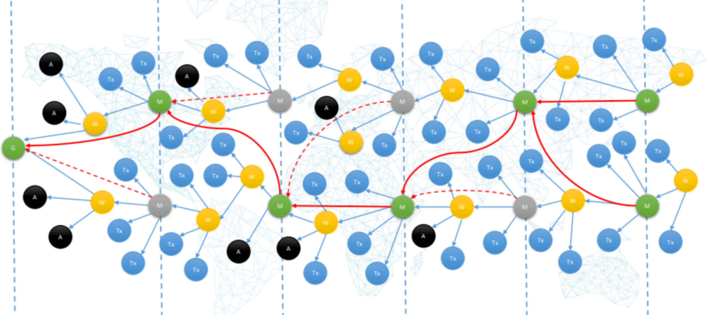
我们知道DAG中都是有主链的一个概念的，因为DAG中的交易需要一个排序，要不然解决不了双花的问题。XDAG里面的主链，是有一个按照时间的分片，每一个分片中都会对交易进行打包，绿色是主链上的主块，黄色是见证块，蓝色是转账交易，黑色是地址块。
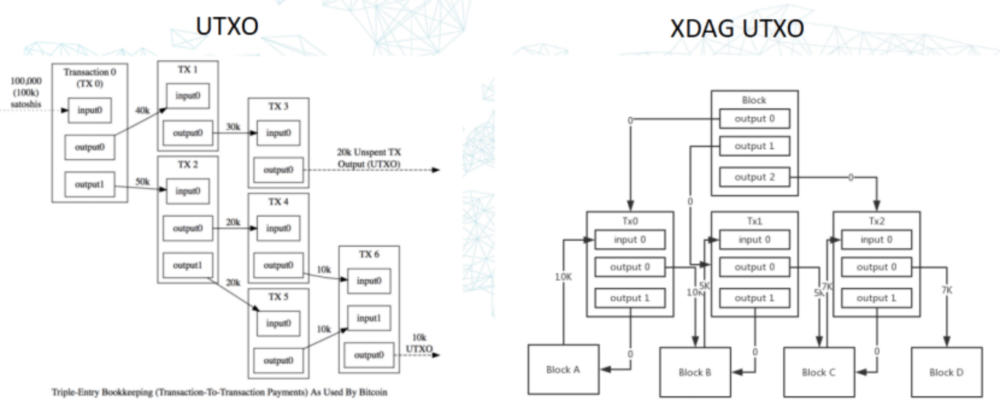
XDAG和Bitcoin类似，也是UTXO的模型，图形可能不太一样，其实本质上是一样的，图中的Block是前面提到的连接块，Tx0，Tx1，Tx2是真正的交易，Block A - D是地址。
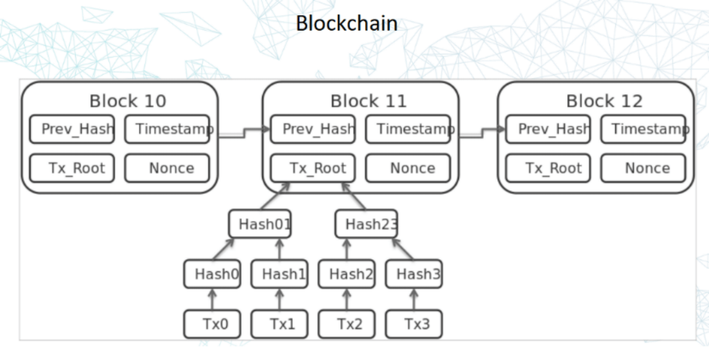
从图中可以看到，区块链中有默克尔树，XDAG中也有类似的结构。
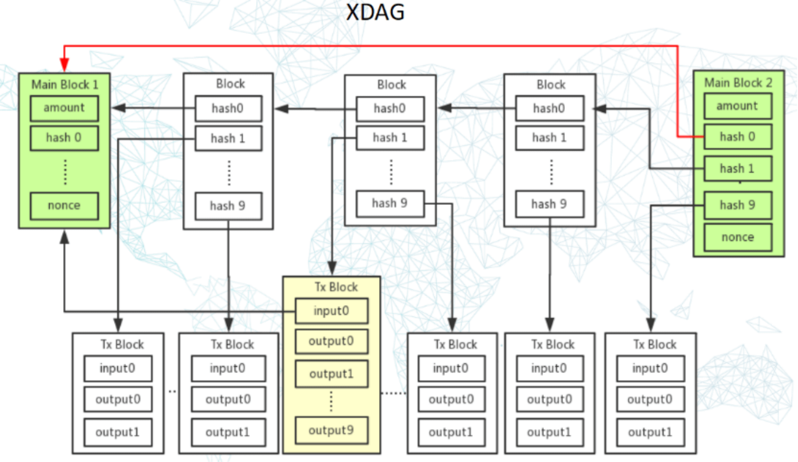
上图中绿色的Main Block存的是交易的hash，和默克尔树类似。

XDAG中POW的计算任务是变化的，矿工把收到的交易加入到自己的hash计算当中，每个节点都会做计算，最终比拼谁的算力最强，然后生成Main Chain的块。
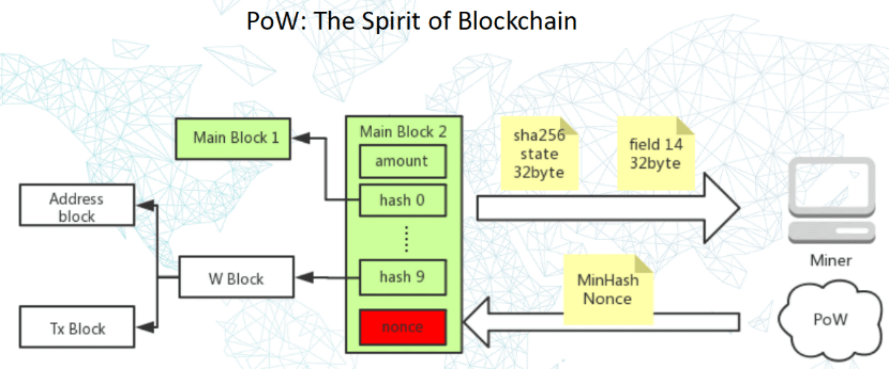
如何做hash呢，就是把局部的区块/交易都进行hash计算，一层一层的做hash计算，最后填入到新的区块当中（Main Block 2），然后进行sha256的计算，sha256做的事情就是做迭代的计算和混淆。对于结果的发送，只需要发送计算出来的sha256的值，而不需要发送所有的交易，大小只有32byte，这样会非常节省带宽资源，这样的话矿工只需要继续计算sha256，最终发现一个最小的hash，从而得到nonce值，确定主链（Main Chain）上新的主块（Main Block），通过这样的方式形成了主链的结构。

注：为保证公平性，XDAG挖矿算法已由sha256调整为RandomX算法。

XDAG如何解决双花：
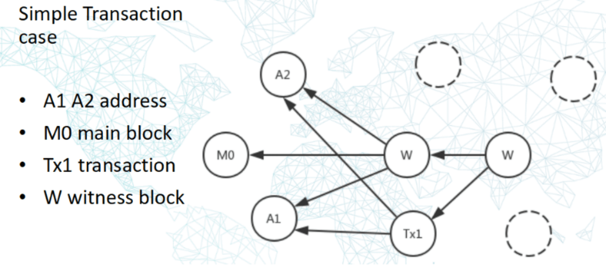
如果A1和A2之间产生交易的话，会有一个新的连接块产生去确认他们之间的交易，连接块的产生来自于矿工。
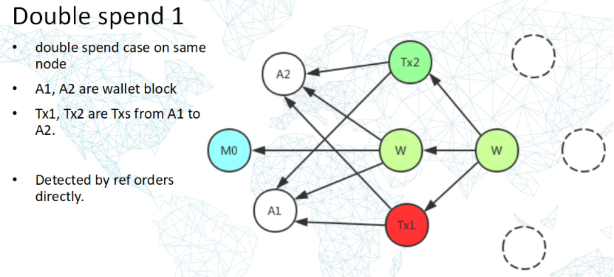
假设A1地址有10个XDAG，A1的钱包被人恶意拷贝了两份，同时发起了两笔转账，一笔Tx1 从A1转了5个XDAG到A2地址，另外一笔Tx2从A1转了7个XDAG到A2地址。两笔转账合计12个XDAG，超出了A1地址原有的10个XDAG，是个典型双花。

在XDAG检测的逻辑是在节点同一时间收到Tx1和Tx2时，节点生成的W块会引用Tx1和Tx2，根据稳定的排序规则Tx2会在被W块引用时填充到了顺序编号更小的field中，从而Tx2优先被处理，而Tx1则后处理，从而检验出Tx1的花费是一次双花，从而在内部块中将这个哈希值指向的交易块标记为拒绝状态，而Tx1这个交易块永远记录在DAG中，不会删除。

因为用户可以选择自己的交易发送给哪个节点做验证，这里假设如果这两个交易都发送给了同一个节点，第一个被连接块引用的交易就是有效交易，第二个就是无效交易了，通过这样的一种方式来解决简单的双花问题。
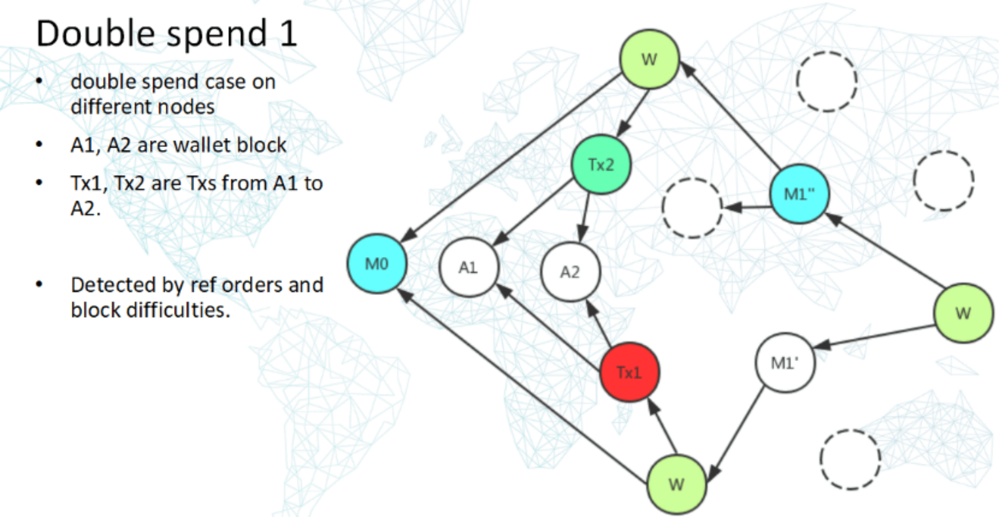
前提条件和上一个一样，假设A1地址有10个XDAG，A1的钱包被人恶意拷贝了两份，同时发起了两笔转账，一笔Tx1 从A1转了5个XDAG到A2地址，另外一笔Tx2从A1转了7个XDAG到A2地址。两笔转账合计12个XDAG，超出了A1地址原有的10个XDAG，是个典型双花。

但是这次情况有变化，那就是此人恶意采用技术手段将钱包连接到不同的节点上，因此就会产生不同节点之间的双花检测。

接收到Tx1交易的节点此时并不知道Tx2交易的存在，而接收到Tx2交易的节点同样不知道Tx1交易的存在，因此这种情况下就需要节点之间的数据交互才能检测。

此时PoW共识就产生作用，在XDAG中每隔64秒即产生一个主块，通过主块M1’ M1’’比较难度，确定出M1’’的难度更高，因此M1’’引用的块Tx2在排序时优先于M1’引用的Tx1，如此检测出Tx1为双花，从而在内部块中将这个哈希值指向的交易块标记为拒绝状态，而Tx1这个交易块永远记录在DAG中，不会删除。

如果遇到有个用户要作弊，发送了这两个交易给不同的节点的话，这个时候就需要通过POW生成的主块（M1'')来解决这个问题了，从上图中可以看到M1''是通过矿工POW算力竞争而生成的主块，而M1'不是，因为主块优先，这样的话，被M1''间接引用的Tx2就是有效交易了，从而解决了双花问题。

XDAG支持高TPS：

XDAG当中为什么可以做到很高的TPS呢？是因为它把DAG拆成了多个局部的小块，所以可以达到类似于分片计算的效果，从而达到一个高的TPS。
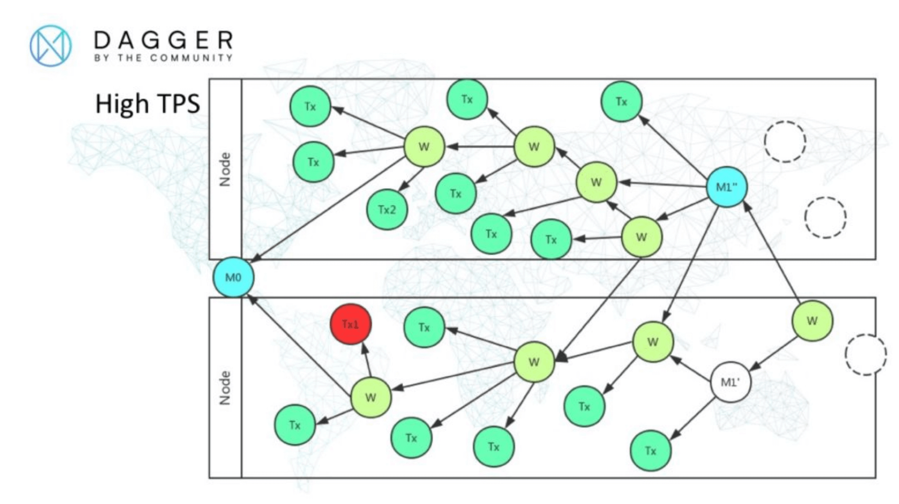
如图是XDAG更全面的DAG结构，其中为了简单起见将前面几张图里的钱包地址块省略展示。

Node表示不同的节点，M 表示PoW挖到的主块，W标示额外的块，我将其命名为见证块。Tx是交易块。

不同节点分别接收各自的交易块，将交易块拼接到DAG中的行为相互之间耦合度较低，通过节点间的数据交互建立之间的联系，从而能够让不同节点很好地吸收较高的并发来达到高TPS。

同时每64秒通过PoW产生一个主块，让去中心化公链的交易确认时间也大大缩短，一般在1到2分钟即可被确认。
## XDAG优势

1. XDAG采用【DAG+POW】方式突破、解决了传统区块链BlockChain技术的限制，能够极大提升区块链系统的吞吐量。XDAG拥有支持POW挖矿、去中心化和TPS高的优点。XDAG网络在POW这种目前最原教主义的去中心化方案下，依然能够拥有高TPS，之前遇到交易风暴的时候，交易量可以达到几千TPS。采用DAG方式理论上是主块（Main Block）之间是可以有无限交易块，但实际情况还是要依赖于网络传输速度和网络上设备的性能。曾经的交易峰值已经到达几千TPS，然而受制于网络、硬件条件，还未实测过交易上限。

2. 对区块链技术友好。在XDAG中提到的块也是一笔交易，钱包所生成的地址（Address）也会在网络中生成一笔交易：Block = Transaction = Address。目前在比特币和以太坊做的一些实验都可以在XDAG上去做，因为创始人自己做过操作系统，所以在设计上也考虑到了这些。

3. 出块快，转账快，无手续费。得益于基础架构DAG技术的特点，目前XDAG设置每64秒产生一个块，转账3分钟内即可到账，手续费为0。这可是在POW去中心化的情况下，达到的高TPS以及快速转账！

4. XDAG能做到资金安全，无黑洞地址。XDAG中所有的钱包地址、交易记录均是块（Block），只要有钱包，那么钱包地址一定是在主网中存在的；如果尝试向一个不存的地址转账则会失败，所以不会存在转到黑洞地址的问题。

5. 原创性。XDAG的【DAG+POW】理念是开创性的、最早的（证据：可通过bitcoinTalk的创世贴查看时间），代码也是原创的。XDAG提供C语言版本及Java版本。

6. 纯社区驱动。无项目方，无预挖，无1CO，每一枚XDAG都是矿工挖矿产出。社区自治团队来自于不同国家的爱好者，共同推动着XDAG进步。

7. 采用RandomX挖矿算法，吸引更多CPU用户加入挖矿，更具公平性。

凭借这些特点，XDAG可以支持众多去中心化场景应用落地，让更多应用移植到XDAG上，免受其他公链拥堵、高额手续费的痛苦。

## XDAG社区自治团队
XDAG的爱好者们成立了社区自治团队，从极客自由开发到有序推进，从社区【阿波罗方案】到现在的【火星计划】，XDAG一步一个脚印，正在快速进步，社区也越来越壮大。

目前XDAG社区自治团队成员来自世界各地有约20余人，分别对应XDAG JAVA/C代码、PC钱包、安卓钱包、IOS钱包、挖矿算法、挖矿软件、网络协议、社区网站、测试、社区运营等不同工作，工作量还是比较大的，需要更多爱好者的加入。在这里也欢迎对XDAG感兴趣的朋友加入到我们的社区当中。

目前社区自治团队已经建立起社区提案机制（ https://trello.com/b/nlSBXa2d/xps ）以及开发者激励机制，大家可以查看下社区网站xdag.io，其中有“悬赏任务”一栏，用于吸引更多开发者的加入。任何人都可以在 XPS 上提出改进建议，并赞助相应的开发费用。这是个示例：
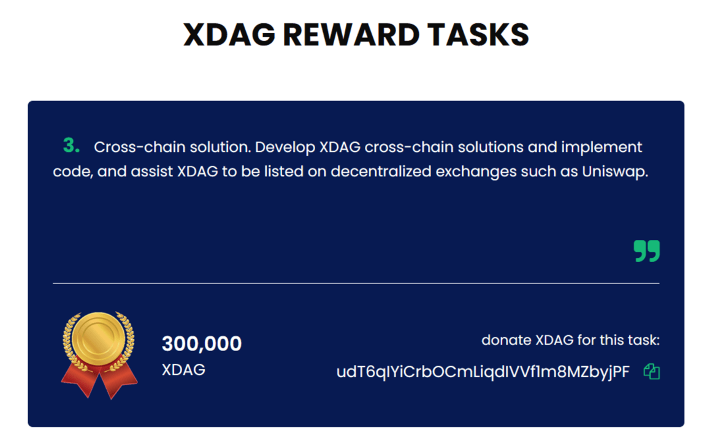

## XDAG相关链接

社区网站： xdag.io

Bitcointalk创世贴：https://bitcointalk.org/index.php?topic=2552368.0

XDAG白皮书地址：https://github.com/XDagger/xdag/blob/master/WhitePaper.md

Github开源地址：https://github.com/XDagger

区块链浏览器地址：https://explorer.xdag.io/

目前已登陆交易平台： coinex.com

## 加入XDAG社区

Discord：https://discord.gg/Nf72gd9

Telegram：https://t.me/dagger_cryptocurrency

推特：https://twitter.com/XDAG_Community

微信公众号：xdag_dev

