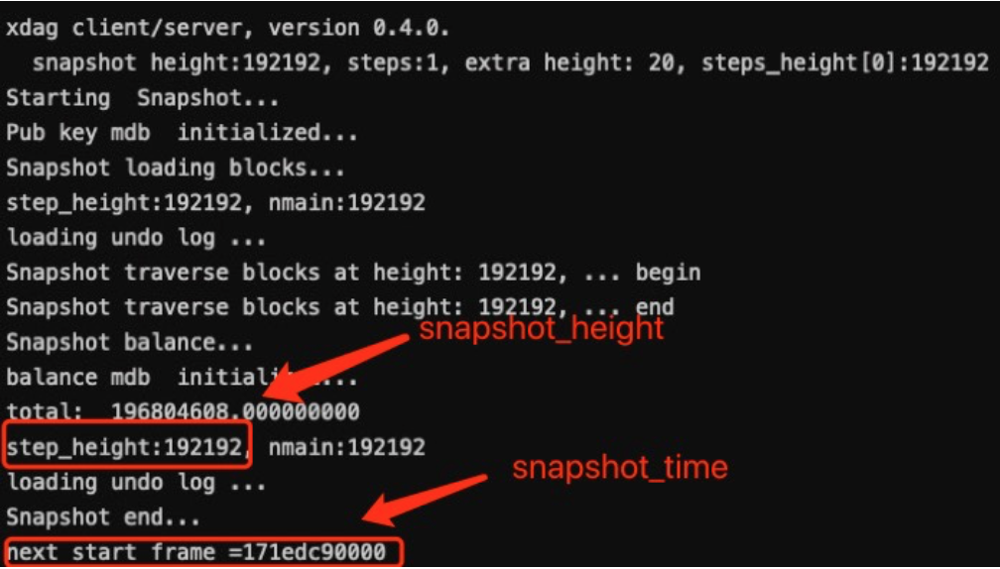

### XDAGJ snapshot loading method


1. import the wallet of the c pool
    ```shell script
    ./xdag.sh --convertoldwallet <your_wallet_path>/wallet-testnet.dat -t
    ```
2. load snapshot ready
    ```shell script
   ./xdag.sh --loadsnapshot <your_snapshot_file_path> -t
    ```
3. load snapshot (snapshot time in hex) 
    ```shell script
    ./xdag.sh -t --enablesnapshot <snapshot_height> <snapshot_time>
    ```
   
   

